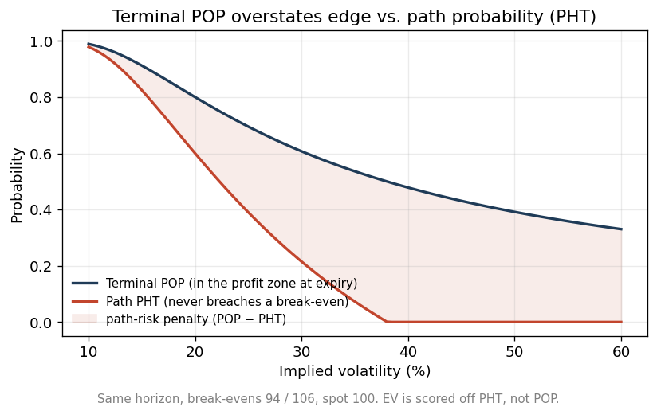
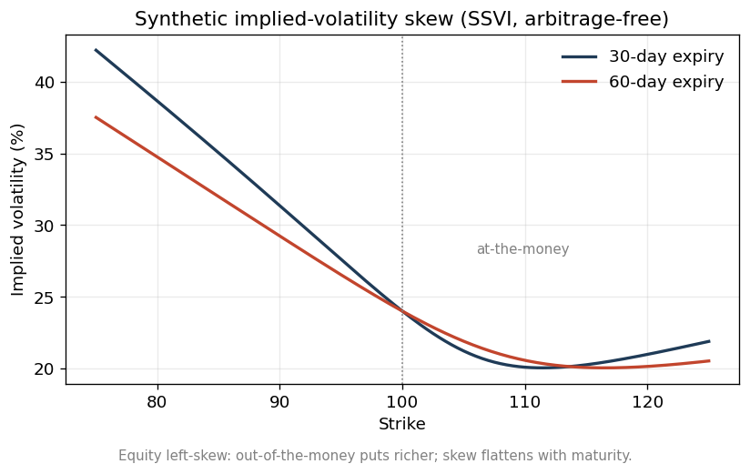
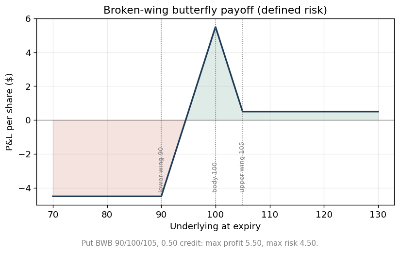

# optvol — systematic options research & model-risk toolkit


A compact, dependency-free Python library for **defined-risk equity-options
research**: options pricing and *path-aware* probability modeling, multi-sleeve
strategy logic (covered calls, bull put spreads, tail hedges), realistic
execution costs, a portfolio-risk overlay, cash-ledger economics, and a
deterministic backtest contract — all wrapped in a **model-risk discipline** that
validates its own approximations against Monte-Carlo simulation.

It runs end-to-end on an **arbitrage-free synthetic option surface** (SSVI), so
everything here reproduces with **no licensed market data**.

> This is the cleaned, open research core of a larger private options program.
> The reorganized library was verified **behavior-identical to the original
> engine across ~108,000 randomized differential comparisons** (see
> [Relationship to the original system](#relationship-to-the-original-system)).

---

## The headline: a model that stress-tests its own approximation — with the *right* benchmark

The library scores expected value from the probability of *holding a defined-risk
structure to target without breaching a break-even* — a **first-passage**
(barrier-hit) probability under a lognormal diffusion, not the naive terminal
"probability of profit." The closed form is exact for each *single* barrier
(continuous first-passage via the reflection principle) but combines the two
barriers **additively**, which omits the joint-crossing term. So the library
measures that omission against Monte-Carlo — and, crucially, against the *right*
Monte-Carlo:


A **naive** MC that only checks the barrier at discrete steps misses crossings
that occur *between* steps, so it overstates survival — a well-known monitoring
bias (open circles, median |Δ| ≈ 0.067). Benchmarked against a **Brownian-bridge
continuity-corrected** MC (Glasserman; Broadie–Glasserman–Kou) — the proper
continuous-monitoring benchmark — the closed form is accurate to a **median of
≈ 0.006** (filled dots): near-exact when the break-evens are far apart, and mildly
conservative only when both are close — never optimistic. Candidate **ranking is
essentially perfect** (Spearman ρ ≈ 0.998, ~10k paths, MC standard error ≈ 0.003).

Two qualifications, stated up front rather than buried:

- This is a **screening / ranking** estimator, not a calibrated absolute-
  probability model. Ranking validity (ρ ≈ 0.998) is what drives candidate
  selection; the small residual bias is *conservative*, so it can only cause the
  pipeline to reject a marginal trade — never to over-select one.
- The principled correction is a proper **two-boundary (double-barrier)
  first-passage** treatment — the joint-crossing term is itself path-dependent
  (Geman–Yor), not a one-line inclusion–exclusion.

Reproduce it yourself:

```bash
python examples/first_passage_vs_montecarlo.py
```

---

## Why path probability, not terminal POP

Most retail tools report a **terminal** probability of profit (where the
underlying finishes at expiry). For a position you *actively manage and exit
before expiry*, that overstates edge: a break-even touched mid-life can stop you
out even if price would have finished back in the profit zone. Over the same
holding horizon, "never breaches" is a subset of "in the profit zone at expiry",
so the path probability is always lower — and the gap is pure path risk:



The library scores EV off the **path** probability (PHT). This single modeling
choice is the difference between a retail screen and an institutional one.

---

## Highlights

- **Pricing & probability** — Black-Scholes with stable bisection IV inversion;
  lognormal terminal POP; **reflection-principle first-passage** and
  path-hold (PHT) probabilities; expected value scored off the path probability.
- **Strategy sleeves** — decision logic for **covered calls**, **bull put
  spreads**, and a **tail hedge**: candidate selection in delta/DTE/liquidity/
  slippage windows, IV-rank position sizing, and roll/exit rule sets.
- **Execution realism** — a **time-varying regulatory fee model** (ORF/TAF/SEC
  Section 31 keyed to their historical effective dates) so a backtest charges the
  fees actually in force on each trade date; plus per-structure commission logic.
- **Portfolio risk overlay** — aggregate / per-symbol / sector / per-sleeve caps,
  a greedy stateful sizer, and a **VIX-regime exposure cut**.
- **Cash-ledger economics** — models the *real* cash flows of an options book:
  assignment/exercise, dividends, tiered margin interest, and T+N settlement — so
  P&L is a cash ledger, not a naive sum of per-leg P&L.
- **Deterministic backtest contract** — a versioned data contract with schema
  validation, and an injectable trading calendar (holiday-free by default,
  holiday-accurate on request).
- **Model-risk discipline** — the first-passage-vs-Monte-Carlo study above; an
  **arbitrage-free SSVI** synthetic surface with a static-no-arbitrage self-check;
  and a **74-test** suite covering every module.

---

## Quickstart

```bash
git clone https://github.com/sebasrenla/defined-risk-options-lab.git
cd defined-risk-options-lab
pip install -r requirements.txt        # only needed for the tests/figures; the core library is pure stdlib

python examples/run_demo_scan.py            # end-to-end pipeline on a synthetic chain
python examples/first_passage_vs_montecarlo.py   # the model-risk validation
python examples/generate_synthetic_chain.py      # the surface + its no-arbitrage report
pytest -q                                    # 74 tests
```

The **core library imports with zero third-party dependencies** (pure Python
standard library). `matplotlib` is used only to render the figures; `pytest` only
to run the tests; `exchange_calendars` is an *optional* upgrade for
holiday-accurate settlement.

A 60-second tour of `examples/run_demo_scan.py`:

```
pricing / IV      ATM call: IV recovered from mid via bisection = 0.2501
kink signal       strike 315 flagged, cross-sectional z = +3.08
butterfly         POP 0.774 > PHT 0.633  ->  EV +0.26  (terminal overstates edge)
sleeves           covered call 312C (Δ0.274);  bull put spread 288/270P (credit 2.75)
risk overlay      both accepted; aggregate defined-risk within the 35%-NAV cap
economics         buy-write booked to the cash ledger; NLV updated
```

---

## Architecture

```
src/optvol/
├── pricing/       Black-Scholes, IV inversion; POP + first-passage / PHT probabilities
├── structures/    broken-wing butterfly payoff, break-evens, POP/PHT/EV
├── signals/       IV-curvature ("kink") signal + z-score standardization
├── scoring/       shaped, bounded sub-scores blended into a composite rank
├── execution/     per-structure fees + time-varying regulatory fee schedules
├── gates/         earnings / corporate-action / macro (FOMC-CPI-NFP) blackouts
├── risk/          portfolio caps + VIX-regime exposure cut (stateful sizer)
├── economics/     cash-ledger: assignment/exercise, dividends, margin, settlement
├── backtest/      versioned data contract + schema validation
├── sleeves/       covered-call, bull-put-spread, tail-hedge decision logic
└── utils/         keyring-based secret loading (no secrets in source)
```

See [`docs/architecture.md`](docs/architecture.md) for the data flow and design
decisions, and [`docs/methodology.md`](docs/methodology.md) for the modeling
detail.

---

## The data: realistic and arbitrage-free by construction

No vendor data ships with this repository. Every demo and test runs on a
**synthetic implied-volatility surface** built with the **SSVI** parameterization
(Gatheral & Jacquier), the standard for a realistic, *statically arbitrage-free*
equity surface:



The generator produces a realistic equity **left-skew** (≈ +11 vol points at ±10%
for 30-day, flattening with maturity), and ships a `check_static_arbitrage()`
self-test that verifies **no butterfly arbitrage** (non-negative risk-neutral
density) and **no calendar arbitrage** (total variance non-decreasing in
maturity). It is deliberately *neutral* — it does not tilt strikes, spreads, or
liquidity to flatter any strategy. Details in
[`docs/synthetic_data.md`](docs/synthetic_data.md).

A recognizable defined-risk payoff, computed by the library:



---

## Model risk & validation

Rigor is the point of this project, not an afterthought. See
[`docs/model_risk_and_validation.md`](docs/model_risk_and_validation.md) for:

- the **first-passage-vs-Monte-Carlo** study (reproduced above);
- the **multi-agent research process** the original program was built under — an
  implementer, an independent challenger, and a human PM, with stage-one
  independence, separation of duties, and an evidence-first quality bar;
- the **~108,000-comparison** differential validation that proved this
  reorganized library behaves almost identically to the original engine;
- the **arbitrage-free** verification of the synthetic surface.

---

## Relationship to the original system

This repository is the **open, sanitized research core** of a larger private
options program. To make it clean, legible, and safe to publish:

- **Behavior was preserved and proven.** Each module was refactored (better
  structure, fewer dependencies) and then checked against the original with
  randomized differential tests — **~108,000 comparisons, all exact** — so the
  published code is *behavior-identical* on the logic it ships.
- **Live plumbing is excluded.** The original's broker order-routing,
  assignment-remediation, and vendor-data ingestion are described in the docs but
  not shipped (they add operational risk, not research insight).
- **Tuned parameters are illustrative.** Where the original uses
  production-calibrated thresholds/weights, this repo ships *example* values and
  explains the reasoning — the functions are identical; only the constants differ.
- **One honest accuracy caveat:** the default settlement calendar is holiday-free
  for zero-dependency runnability; inject a real exchange calendar
  (`exchange_calendar_sessions("XNYS")`) for holiday-accurate settlement.

---

## Testing

```bash
pytest -q      # 74 tests, ~0.3s
```

The suite covers pricing/probability, butterfly geometry, fees, event gates,
portfolio risk, cash-ledger economics, the strategy sleeves, scoring, and a test
that asserts the synthetic surface is arbitrage-free.

---

## Data notice & disclaimer

- **No third-party or vendor market data is included.** See
  [`DATA_NOTICE.md`](DATA_NOTICE.md).
- This is a **research and educational** project — not investment advice, and not
  affiliated with or endorsed by any firm. See [`DISCLAIMER.md`](DISCLAIMER.md).

## License

MIT — see [`LICENSE`](LICENSE).
