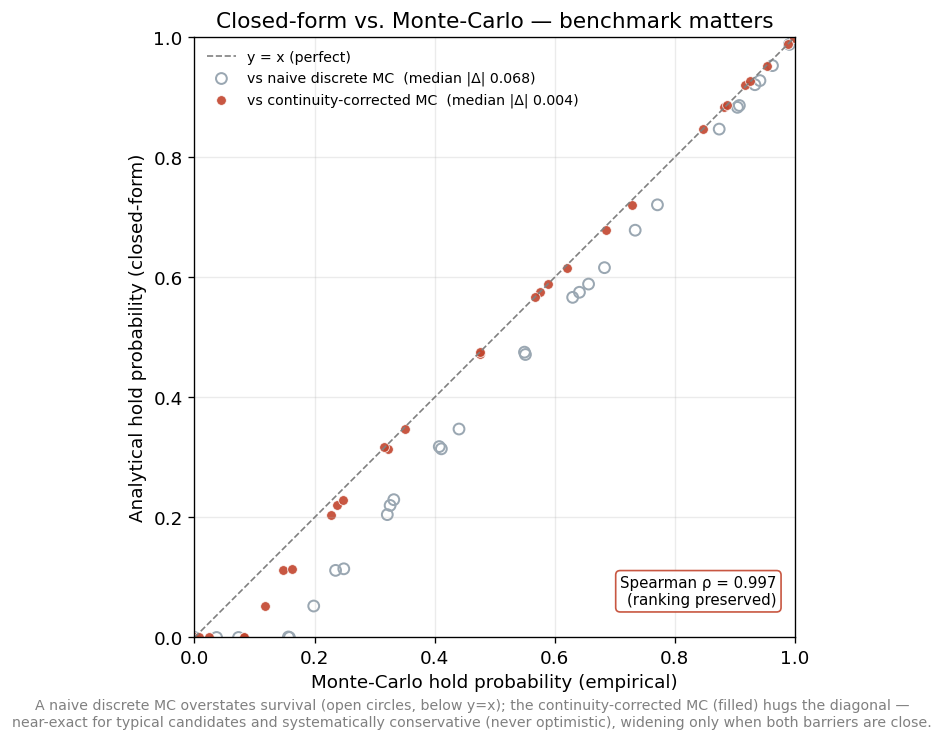

# Model Risk & Validation

A model is only as trustworthy as the discipline around it. This project treats
validation as a first-class deliverable, at three levels: **the model checks its
own approximations**, **the data is verified admissible**, and **the code is
proven to behave as intended**.

---

## 1. Case study: first-passage probability vs. Monte-Carlo

The library scores expected value from a closed-form **first-passage** (path-hold)
probability, `PHT`. The closed form is *exact for each single barrier* (continuous
first-passage via the reflection principle) but combines the two break-evens
**additively**, `p_breach ≈ p_hit_lower + p_hit_upper`. That omits the
joint-crossing term `P(hit lower AND hit upper)` (inclusion–exclusion), so it
overstates breach and *understates* survival. The interesting question is not
*whether* it is biased (the math says it is) but *by how much, where, and
relative to what benchmark*.

### Getting the benchmark right

This is the subtle part. A **naive** Monte-Carlo that checks the barrier only at
discrete time steps misses crossings that happen *between* steps (a continuous
path can dip through a barrier and return unseen), so it *undercounts* breaches
and **overstates** survival. This "monitoring bias" is `O(1/√steps)` and is a
well-documented trap in barrier simulation. Validating an analytical model against
a biased benchmark would overstate the analytical error.

So the benchmark here uses a **Brownian-bridge continuity correction**
(Glasserman 2004; Broadie–Glasserman–Kou 1997): between two simulated log-prices
`x₀, x₁` over a step of variance `v = σ²·dt`, the probability the path crossed an
upper level `b` (with `x₀, x₁ < b`) is `exp(−2(b−x₀)(b−x₁)/v)`, and symmetrically
for a lower level. Each path contributes its *conditional survival probability*
(the product over steps of not crossing either barrier), an essentially unbiased
estimator of the continuous-monitoring probability.

Both the analytical model and the bridge-corrected MC use the **same zero-log-drift
diffusion** (`d ln S = σ dW`), the convention under which the reflection
first-passage is exact per barrier. (This is a deliberate screening choice; it
differs by `−½σ²` from the risk-neutral drift used for *terminal* valuation, a
second-order effect over these short horizons, but keeping the two dynamics
identical is what makes the comparison mean one thing. Matching the MC to a
martingale drift instead leaves the result essentially unchanged (median ≈ 0.006,
ρ identical), so the choice buys attribution, not magnitude.) Because both share
that diffusion and both treat each single barrier by continuous first-passage,
their *only* remaining difference is the additive-vs-joint treatment of the two
barriers, so `bridge_MC − analytical` isolates the additive-approximation error
itself, not a drift mismatch, a discretization artifact, or a modelling difference.
`examples/first_passage_vs_montecarlo.py` reproduces all of this (30 synthetic
candidates spanning volatilities, horizons, and asymmetric barriers near and far
from spot; ~10k paths).

### Result

- **The naive benchmark is the one that's biased.** The naive discrete MC
  overstates survival by ≈ +0.055 on average versus the corrected benchmark
  (open circles, median gap to the closed form ≈ 0.068). Comparing against it
  would have *overstated* the model's error many times over.
- **Against the corrected benchmark, the closed form is accurate.** The typical
  error is **near-exact**, median absolute error ≈ **0.004**, at the MC standard-
  error floor (≈ 0.003), and materially conservative only when *both* barriers are
  close, where the additive term double-counts (mean ≈ 0.015, carried by those
  cases). What makes the bias *real* rather than noise is its **direction**: the
  closed form is ≤ the corrected MC in **25 of 30** candidates, a systematic
  understatement of survival (sign-test p < 0.001), **never optimistic**.
- **Ranking is preserved**: Spearman ρ ≈ **0.997** between the closed form and the
  corrected benchmark.

### Ranking validity ≠ probability calibration

A near-perfect rank correlation does **not** imply the probabilities are
calibrated: a model can rank perfectly while being biased by a constant. That
distinction matters:

- The library uses `PHT` to **screen and rank** candidates, where ρ ≈ 0.997 is
  exactly the property that counts, and the residual bias is *conservative*: it
  can only push a marginal candidate *below* the acceptance threshold (reject a
  possibly-good trade), never *above* it (accept a bad one).
- For a use that depends on the **absolute** probability (fine-grained position
  sizing or capital allocation), the residual bias would matter, and the
  principled correction is a proper **two-boundary (double-barrier) first-passage
  treatment**: the joint-crossing term is itself a hard path-dependent quantity
  (Geman–Yor 1996), addressable by an exact/semi-analytic double-barrier method or
  a bridge-corrected numerical solution, *not* a one-line inclusion–exclusion.

**A note on scope.** This study validates the two-barrier *approximation* under a
given lognormal diffusion. It does **not** claim that constant-volatility
lognormal dynamics are consistent with a full implied-volatility smile; they are
not. The smile enters *vanilla valuation*; the barrier path model here uses the
structure's implied volatility as its (single) diffusion parameter, a deliberate
screening-model simplification. A smile-consistent path model (local- or
stochastic-volatility) is a natural extension, and the honest framing is that this
is a *screening* probability, not a fair-value one.

**Judgment.** The disciplined conclusion: measure the error against the *correct*
benchmark, keep the fast conservative estimator for screening/ranking (where it is
accurate and safe), and reserve the heavier double-barrier machinery for any use
that needs a calibrated absolute probability. Over-reacting to a known,
conservative, rank-preserving, sub-1%-median bias (or, worse, "validating" it
against a naive benchmark that is itself more biased than the model) would be the
real error.

---

## 2. The research process behind the original program

The larger program from which this library was extracted was built under an
explicit **multi-agent research workflow** designed to prevent the failure mode
where an author quietly agrees with their own first idea:

- **Implementer**: converts an approved work packet into a patch plan, writes
  the code and tests, and supplies reproducible evidence.
- **Independent challenger**: stress-tests the assumptions, formulas, and
  thresholds, hunts for institutional-realism gaps, and proposes alternatives.
- **Human PM**: approves each packet's objective and constraints and owns the
  final decision gate.

The operating discipline is what makes it credible rather than a gimmick:

- **Stage-one independence**: each side drafts its position *before* reading the
  other's, to guard against anchoring.
- **Separation of duties**: the implementer cannot self-approve a closure; the
  challenger must sign the audit.
- **Evidence-first quality bar**: a task is not "done" without a patch (or a
  no-change conclusion), a reproducible command list, **before/after metrics**,
  evidence file paths, and a recorded decision.

The agents drew on a **curated corpus of finance, quantitative-methods, and
computer-science books and articles** as reference material during research.

This process produced real improvements, not just paperwork; for example, the
challenger's reviews repeatedly caught defects an implementer then fixed, and a
scoring recalibration was adopted only after it was shown to reduce portfolio
concentration under sign-off. The first-passage-vs-Monte-Carlo study above is one
artifact of that process.

---

## 3. Verifying the published library against the original

Refactoring risks silently changing behavior. To rule that out, every module in
this repository was checked against the original engine with **randomized
differential testing**: generate random but valid inputs, run both
implementations, and assert the outputs match.

**Result: ~108,000 comparisons, all exact matches** on the logic that ships,
across pricing, first-passage/POP probabilities, butterfly geometry, the IV-
curvature signal, composite scoring, both fee models, the event gates and data-
contract validators, the portfolio-risk engine, the cash-ledger economics, and
all three strategy sleeves. Two modules were deliberately *re-implemented* rather
than copied (the pandas-based selectors, made dependency-free, and the settlement
calendar, made injectable); the differential tests confirm they are still
behavior-identical when given the same inputs.

*(The differential harness imports the original private engine and is therefore
not part of this public repository; the ~108k figure is the aggregate of those
comparisons.)*

---

## 4. Verifying the synthetic data is admissible

The demos and tests must not run on data that flatters the model. The synthetic
surface is built with the **SSVI** parameterization and ships a
`check_static_arbitrage()` self-test that verifies:

- **no butterfly arbitrage**: call prices are convex in strike, i.e. the implied
  risk-neutral density is non-negative (checked on a uniform-strike grid); and
- **no calendar arbitrage**: total implied variance is non-decreasing in
  maturity.

One of the published tests asserts this property directly, so a change that made
the surface arbitrageable would fail CI. See
[`docs/synthetic_data.md`](synthetic_data.md) for the full construction and the
realism argument (a market-representative equity skew, neither under- nor
over-stated).

---

## 5. The test suite

`pytest -q` runs 74 invariant and known-value tests over every shipped module,
including put-call parity, IV round-trips, the `POP ≥ PHT` relationship,
date-accurate fee resolution, the cap/regime logic, the cash-ledger-vs-leg-sum
distinction, the sleeve decision rules, and the arbitrage-free surface. They run
in about 0.3 seconds with zero third-party dependencies beyond `pytest` itself.

---

## References

- Broadie, M., Glasserman, P., & Kou, S. (1997). *A continuity correction for
  discrete barrier options.* Mathematical Finance.
- Glasserman, P. (2004). *Monte Carlo Methods in Financial Engineering*
  (barrier options via Brownian-bridge conditioning).
- Geman, H. & Yor, M. (1996). *Pricing and hedging double-barrier options: a
  probabilistic approach.* Mathematical Finance.
- Gatheral, J. & Jacquier, A. (2014). *Arbitrage-free SVI volatility surfaces.*
  Quantitative Finance.
